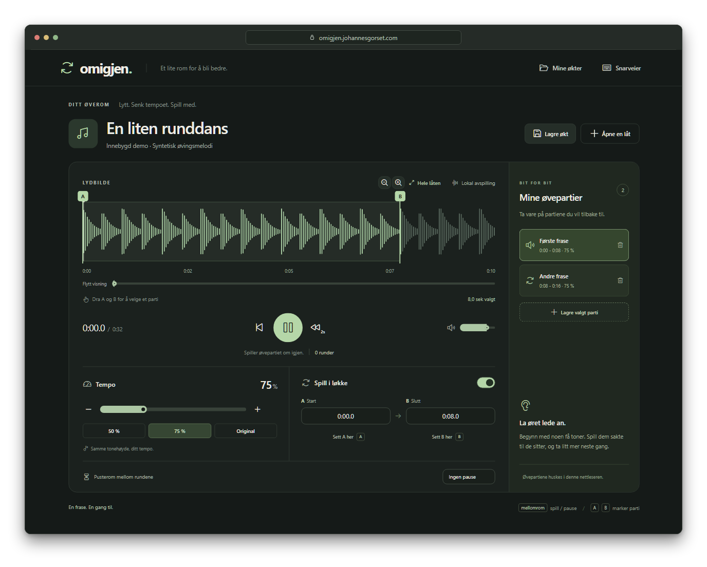

# Omigjen

A little practice room for learning tunes by ear. Slow them down, loop the difficult bits, and save your place for next time.

[Try it](https://omigjen.johannesgorset.com).



Paste a YouTube link or open an audio file, mark a phrase with A and B, and play along. Saved sessions and audio stay in your browser.

## Run it

Requires Node 22.12+.

```sh
npm ci
npm run dev
```

Open http://127.0.0.1:5177.

The local version can also fetch YouTube audio. Install [FFmpeg](https://ffmpeg.org/download.html), then run `npm run setup:downloads`.

[Hosting setup](docs/hosting.md).

[MIT licensed](LICENSE).
